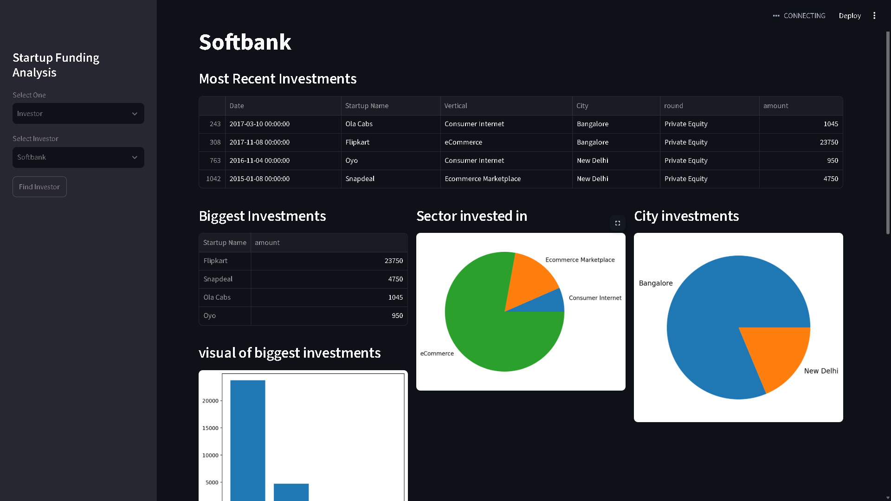

# Indian Startup Funding Analysis

A beginner-friendly data analytics project built using **Python, Pandas, Matplotlib and Streamlit** to analyze Indian startup funding data.

## Dashboard Preview



## Project Overview

This project explores Indian startup funding data and presents the analysis through an interactive Streamlit dashboard.

The dashboard provides three main sections:

- **Overall Analysis**
- **Startup Analysis**
- **Investor Analysis**

The purpose of this project was to practice data cleaning, data analysis, visualization and dashboard development using Python.

---

## Features

### 1. Overall Analysis

Provides an overview of the startup funding data.

- Total funding
- Maximum funding
- Average funding
- Total funded startups
- Month-on-month funding analysis
- Sector analysis
- Funding type analysis
- City-wise funding
- Top startups overall
- Top startups year-wise

### 2. Startup Analysis

Allows users to select an individual startup and explore its funding information.

- Company name
- Industry
- Sub-industry
- Location
- Total funding
- Number of funding rounds
- Investors
- Funding rounds with date and amount
- Funding trend
- Similar companies

> Founder information is not included because it is not available in the dataset used for this project.

### 3. Investor Analysis

Allows users to select an investor and analyze their investment activity.

- Recent investments
- Biggest investments
- Sectors invested in
- Funding stages
- City-wise investments
- Year-wise investment trend
- Similar investors

---

## Technologies Used

- **Python**
- **Pandas**
- **Matplotlib**
- **Streamlit**

---

## Dataset

The dataset used in this project was sourced from **Kaggle**.

The dataset contains information related to Indian startup funding, including:

- Startup name
- Funding date
- Industry
- Sub-industry
- City
- Investors
- Funding round
- Funding amount

The data was cleaned and prepared before being used for analysis.

---

## Learning Reference

I used the **CampusX YouTube channel** as a learning and reference source while building this project.

The project helped me practice:

- Data cleaning with Pandas
- GroupBy and aggregation
- Working with dates
- Data visualization
- Exploratory data analysis
- Streamlit
- Building interactive dashboards

The project was implemented and modified according to my own understanding and requirements.


## How to Run

### 1. Clone the repository

```bash
git clone <https://github.com/Sir0204/Indian-Startup-Analysis.git>
```

### 2. Open the project folder

```bash
cd Indian-Startup-Funding-Analysis
```

### 3. Install the required libraries

```bash
pip install -r requirements.txt
```

### 4. Run the Streamlit application

```bash
streamlit run Website.py
```

The dashboard will open in your browser.

---

## Project Status

**Completed**

This project was created as a student data analytics project while learning Python, Pandas, data visualization and Streamlit.
